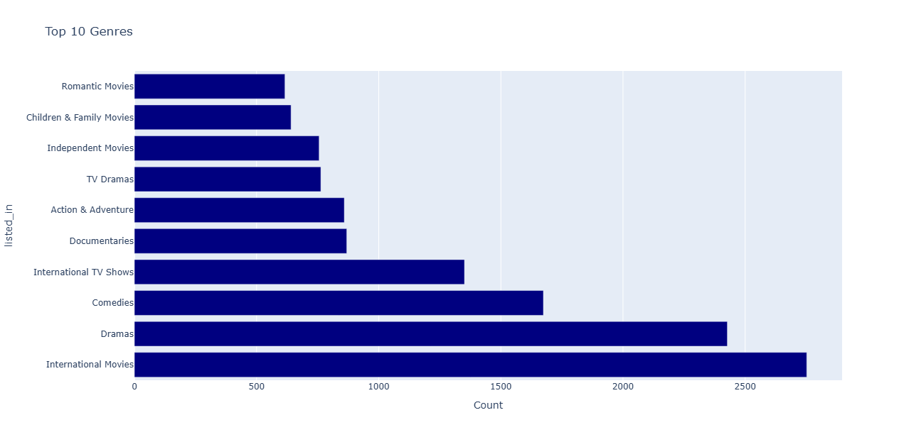
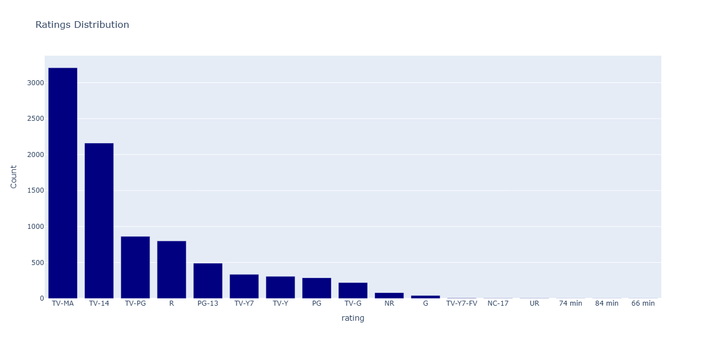

---

# 🎬 Netflix Data Analysis

This project explores Netflix’s catalog of TV shows and movies through **exploratory data analysis (EDA)**. Using **Python, Pandas, and Plotly**, I examined genres, directors, ratings, and content growth over the years. The outputs include **visualizations** and **CSV summaries**, making it easy to see both the insights and the underlying data.

---

## 🚀 Features

* **Top Genres** → Most frequent content categories on Netflix
* **Top Directors** → Directors with the highest number of shows/movies
* **Growth Trends** → Number of titles added over time
* **Ratings Breakdown** → Distribution of content across rating categories
* **Exports** → CSV files for each analysis + interactive charts for visualization

---

## 🛠️ Tools & Libraries

* **Python 3.11**
* **Pandas** – data cleaning & analysis
* **Plotly** – interactive charts
* **NumPy** – data handling support
* **CSV exports** – save results for reuse

---

## 📂 Project Structure

```
NETFLIX-PROJECT/
│
├── inputs/
│   └── netflix_titles.csv        # Dataset
│
├── outputs/                      # Generated results
│   ├── Top_Genres.csv
│   ├── Top_Directors.csv
│   ├── Shows_Over_Years.csv
│   ├── Ratings_Distribution.csv
│   ├── top_genres.html           # Interactive Plotly charts
│   ├── top_directors.html
│   ├── shows_over_years.html
│   └── ratings_distribution.html
│
└── main.py                       # Analysis script
```

---

## 📊 Sample Visualizations




---

## 💡 Key Insights

* Drama and International content dominate the Netflix catalog
* A small set of directors appear frequently, showing recurring partnerships
* The library expanded sharply after 2015
* Content is heavily skewed toward **TV-MA** and **TV-14** ratings

---

## 🏁 How to Run

1. Clone the repo:

   ```bash
   git clone https://github.com/yourusername/netflix-project.git
   cd netflix-project
   ```
2. Install dependencies:

   ```bash
   pip install pandas plotly numpy
   ```
3. Run the script:

   ```bash
   python main.py
   ```
4. Check results in the **outputs/** folder.

---

## 📌 Dataset

[Netflix Titles on Kaggle](https://www.kaggle.com/shivamb/netflix-shows)

---
